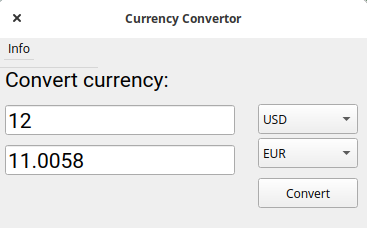

# currency-converter
This is a simple GUI app built with python that lets you convert currency!

### Screenshot


### Setting it up:
Since this app gets the current exchange rates from the web, you will need to install BeautifulSoup.


If you're on windows:

```
pip install python-bs4
```

If you're on linux or mac:

```
pip3 install python-bs4
```
Happy Coding!
